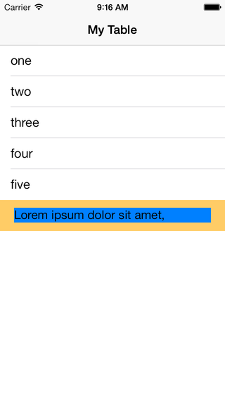
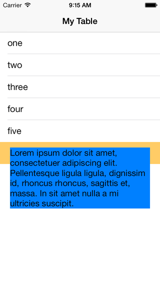

Resize a UITableView footerView using autolayout
================================================

My goal is to create a tableFooterView that does resize itself by being connected to the contained UILabel.

If I put the layout constraints on the UILabel to keep a constant space to all four edges plus that the height of the label can extend, the label won't resize at all, as you can see from the first screenshot.

But if I remove the bottom constraint so that the label view can increase it's height, the label is growing as I would expect.

The table view does get the size of the footer view by assigning the footer to the table:

<code>
[self.tableView setTableFooterView:_footerView]
</code>

Resizing the footer view won't inform the table view about the new height.
